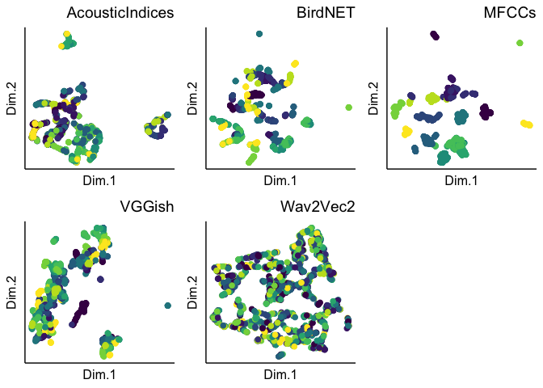

<!-- README.md is generated from README.Rmd. Please edit that file -->

# Overview

This is the repository for: ‘Mel-frequency cepstral coefficients
outperform embeddings from pre-trained convolutional neural networks
under noisy conditions for discrimination tasks of individual gibbons’
(Lakdari et al, under review). The goal of the paper is to compare
different approaches of feature extraction for individual discrimination
of gibbon female calls.

Feature extraction was done in both R and Python, and analyses for
publication were done in R.

# Data availability

Acoustic data can be downloaded at: 10.5281/zenodo.8205685.

## Metadata for all data included in the repository.

<table>
<thead>
<tr>
<th style="text-align:left;">
FileLocation
</th>
<th style="text-align:left;">
Description
</th>
<th style="text-align:left;">
Date
</th>
<th style="text-align:left;">
DateType
</th>
<th style="text-align:left;">
Summary
</th>
</tr>
</thead>
<tbody>
<tr>
<td style="text-align:left;">
data/features
</td>
<td style="text-align:left;">
A folder containing the different feature sets for each .wav file, along
with recorder ID that include location, time, and date. There is also a
column for individual ID
</td>
<td style="text-align:left;">
Fri Sep 15 08:49:34 2023
</td>
<td style="text-align:left;">
Folder
</td>
<td style="text-align:left;">
The folder contains .csv files for acoustic indices, BirdNET, MFCCs,
VGGIsh, and Wav2Vec2. For VGGIsh and BirdNET the .csv files are divided
by recorder location.
</td>
</tr>
<tr>
<td style="text-align:left;">
data/MB Playbacks 50 m.csv
</td>
<td style="text-align:left;">
A .csv file containing the GPS coordinates of the recorders
</td>
<td style="text-align:left;">
Fri Sep 15 08:49:34 2023
</td>
<td style="text-align:left;">
.csv
</td>
<td style="text-align:left;">
This file contains the GPS coordinates of each recorder M01-M09
</td>
</tr>
<tr>
<td style="text-align:left;">
data/randomization_affinity
</td>
<td style="text-align:left;">
Contains a .csv files for each feature type
</td>
<td style="text-align:left;">
Fri Sep 15 08:49:34 2023
</td>
<td style="text-align:left;">
Folder
</td>
<td style="text-align:left;">
This file contains the classification accuracy, recorder, number of
clusters returned by affinity propagation clustering, and normalized
mutual information value
</td>
</tr>
<tr>
<td style="text-align:left;">
data/randomization_hdbscan
</td>
<td style="text-align:left;">
Contains a .csv files for each feature type
</td>
<td style="text-align:left;">
Fri Sep 15 08:49:34 2023
</td>
<td style="text-align:left;">
Folder
</td>
<td style="text-align:left;">
This file contains the classification accuracy, recorder, number of
clusters returned by hdbscan, and normalized mutual information value
</td>
</tr>
<tr>
<td style="text-align:left;">
data/snr_df
</td>
<td style="text-align:left;">
Contains a .csv files for each recorder location
</td>
<td style="text-align:left;">
Fri Sep 15 08:49:34 2023
</td>
<td style="text-align:left;">
Folder
</td>
<td style="text-align:left;">
This file contains the recording ID, signal-to-noise ratio, recorder,
and wave file path.
</td>
</tr>
</tbody>
</table>

# Feature/embedding extraction on the audio data

### MFCCs

MFCCs are calculated using the ‘Processing features for randomization.R’
R script.

### BirdNET

Follow the installation instructions here:
<https://github.com/kahst/BirdNET-Analyzer>. Then use the ‘BirdNET
Terminal Script’. Then run the ‘Processing features for randomization.R’
R script to convert BirdNET embeddings into the format needed for
analyses.

### VGGish

Follow installation instructions:
<https://github.com/tensorflow/models/blob/master/research/audioset/vggish/README.md>.
Then use the ‘VGGish Terminal Script’. Then run the ‘Processing features
for randomization.R’ R script to convert VGGish embeddings into the
format needed for analyses.

### Wav2Vec2

Wav2Vec2 embeddings are caluclated using the ‘Wav2Vec2_Features.py’
Python script.

### Acoustic indices

Acoustic indices are calculated using the ‘Processing features for
randomization.R’ R script.

# SNR calculation on audio data

SNR calculation is done on sound clips that have an extra 2-s on either
side of the call using the ‘SNR Calculation’ R script.

# Supervised classification and unsupervised clustering of processed data

Use the ‘Randomization for playbacks.R’ script to randomly divide data
for each feature and distance category using a 80/20 split. This script
uses the processed data for each feature located in the
‘data/features/features’ folder.

# Creating plots for publication

See ‘Script to recreate figures.R’ to recreate all figures in
publication.

<figure>

<figcaption aria-hidden="true">Figure 1. Uniform Manifold Approximation
and Projections (UMAP) of female gibbon calls recorded ~ 50 m away from
the playback speaker for each feature type.</figcaption>
</figure>
